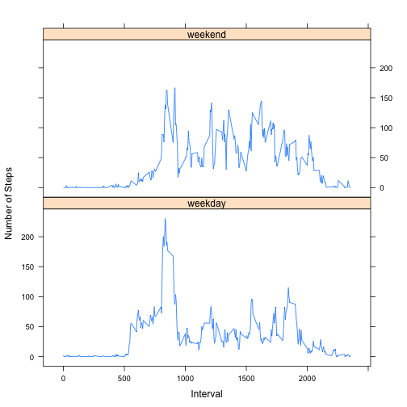

# Peer Assessment 1

## Loading and preprocessing the data

Read the file into R, assuming the file already exst on your working directory.

```r
activity <- read.csv("activity.csv")
```

## What is mean total number of steps taken per day?

```r
##Calculate the total number of steps per day
StepsDay <- aggregate(activity["steps"], by = activity[c("date")], FUN=sum, na.rm=FALSE)

##Generate historgram 
hist(StepsDay$steps,breaks=14,col='red',main="Total number of steps per day",xlab="Steps taken per day")
```

 

```r
stepsDay_mean <-format(mean(StepsDay$steps, na.rm=TRUE),digits=5,nsmall=0)
stepsDay_median <- median(StepsDay$steps, na.rm=TRUE)
```
The average number of steps taken per day is 10766, and the median is 10765.


## What is the average daily activity pattern?


```r
##Calculate the average steps by interval across all days.
StepsInterval <- aggregate(activity["steps"], by = activity[c("interval")], FUN=mean, na.rm=TRUE)

##Plot the results
plot(StepsInterval$interval,StepsInterval$steps,
     type="l",
     xlab="Interval",
     ylab="Steps Taken",
     main = "Average Stepts taken by Interval")
```

 

```r
##Get the  5-minute interval with the maximum number of steps?
max_interval <- StepsInterval[which.max(StepsInterval$steps),1]
```
The 5-minute interval with the maximum number of steps across all days is 835


## Imputing missing values

```r
total_obs <- nrow(activity)
missing_obs <-sum(is.na(activity))
complete_obs <- sum(complete.cases(activity))
pct_missing <- sprintf("%.1f %%", 100*(missing_obs / total_obs))
```

The activity.csv file has 2304 (13.1 %) observations with missing values, out of 17568 observations. 

For filling the missing values, we will replace the missing values for each interval with by the average steps across all days for that interval in a new data frame.


```r
complete <- merge(activity,StepsInterval,by="interval")
names(complete)[2] = c("steps")
names(complete)[4] = c("avg_stepsinterval")
complete$steps <- ifelse(is.na(complete$steps),round(complete$avg_stepsinterval,0),complete$steps)
```

On the new data frame, we calculate the mean and median of the total number of steps taken per day.


```r
complete_StepsDay <- aggregate(complete["steps"], by = complete[c("date")], FUN=sum, na.rm=FALSE)

complete_stepsDay_mean <-format(mean(complete_StepsDay$steps, na.rm=TRUE),digits=5,nsmall = 0)

complete_stepsDay_median <- format(median(complete_StepsDay$steps, na.rm=TRUE),digits=8,nsmall= 0)

hist(complete_StepsDay$steps,breaks=14,col='red',main="Total number of steps per day",xlab="Steps taken per day")
```

 

The average number of steps taken per day, after filling the missing values, is 10766, and the median is 10762.

There are not significant changes in the mean and median of stapes Taken by Interval after imputing the missing values with the mean steps for each interval. One of the benefits of utilizing the mean to replace missing values, is that the sample mean does not change.

## Are there differences in activity patterns between weekdays and weekends?

To answer this question, we used the dataframe whith the filled-in missing values.


```r
complete$date <- strptime(complete$date, "%Y-%m-%d")

complete$day_type <- ifelse(weekdays(complete$date) %in% c("Sunday", "Saturday"),"weekend","weekday")

StepsInterval <- aggregate(complete["steps"], by = complete[c("day_type","interval")], FUN=mean, na.rm=TRUE)

library(lattice)
xyplot(steps ~ interval | day_type, data = StepsInterval, 
       layout = c(1,2),type="l",
       xlab="Interval",
       ylab="Number of Steps" )
```

 

From the above graph, it can be deducted that the activity during the weekend is consistent across all intervals; while during weekdays the activity increases in the early intervals, and then declines


